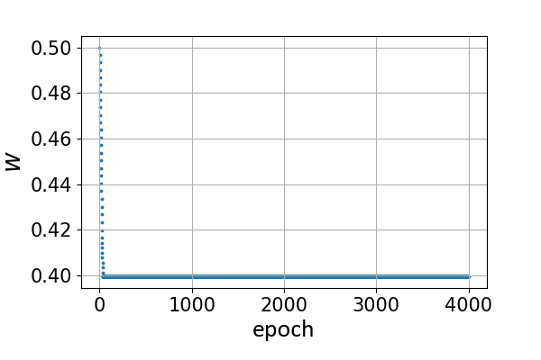
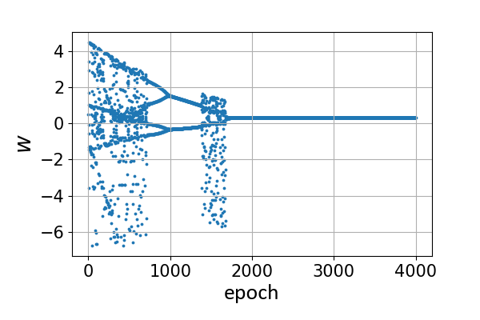

# Chaotic Spiking Back-propagation (CSBP)
CSBP introduces chaotic loss to generaten brain-like chaotic dynamics, which can be used as a plug-in unit for SNN direct training. An exmaples is shown below.
## Example
The experiment of a single spiking neuron in the paper is shown in the following.
### 1. import packages for deep learning and ploting
```python
import torch
import torch.nn as nn
import matplotlib.pyplot as plt
from matplotlib.ticker import MultipleLocator, FormatStrFormatter
import numpy as np
```
### 2. define the surrogate function and single-neuron network
```python
class ZIF(torch.autograd.Function):
    @staticmethod
    def forward(ctx, input, gama):
        out = (input > 0).float()
        L = torch.tensor([gama])
        ctx.save_for_backward(input, out, L)
        return out

    @staticmethod
    def backward(ctx, grad_output):
        (input, out, others) = ctx.saved_tensors
        gama = others[0].item()
        grad_input = grad_output.clone()
        tmp = (1 / gama) * (1 / gama) * ((gama - input.abs()).clamp(min=0))
        grad_input = grad_input * tmp
        return grad_input, None
# define the single-neuron network with the surrogate gradient
act_fun = ZIF.apply
def mem_update(ops, x, mem, spike):
    mem = mem * 0.2 * (1. - spike) + ops(x)
    spike = act_fun(mem-thresh, 1) # act_fun : approximation firing function
    return mem, spike
class SNN(nn.Module):
    def __init__(self, w=0.5, b=0.5, time_window=20):
        super().__init__()
        self.layer = nn.Linear(1, 1)
        nn.init.constant_(self.layer.weight, w)
        nn.init.constant_(self.layer.bias, b)
        self.time_window = time_window
    def forward(self, x):
        mem = spike = sum_spike = torch.zeros([1, 1], device=device)
        inp_spikes = torch.zeros((x.shape[0], self.time_window), device=device)
        for step in range(self.time_window):
            mem, spike = mem_update(self.layer, x, mem, spike)
            sum_spike += spike
        out = sum_spike / time_window
        h = self.layer(x)
        return out, h, mem
```
### 3. Training without CSBP 
```python
# setting hyper-parameters
thresh = 1 # neuronal threshold
lens = 0.5 # hyper-parameters of approximate function
decay = 0.5 # decay constants
time_window = 10
device = torch.device("cuda" if torch.cuda.is_available() else "cpu")
def set_seed(seed):
    torch.manual_seed(seed)
    torch.cuda.manual_seed(seed)
    torch.backends.cudnn.deterministic = True
    np.random.seed(seed)
set_seed(10)
loss_fun = nn.MSELoss()

# training
inp = torch.FloatTensor([[1]]).to(device) # input sample
tgt = torch.FloatTensor([[0]]).to(device) # target of input

net = SNN()
net.to(device)
loss_list = []
w_list = []
b_list = []

optimizer = torch.optim.SGD(net.parameters(), lr=0.001)
for epoch in range(4000):
    net.zero_grad()
    optimizer.zero_grad()
    out = net(inp)
    loss = loss_fun(out[0], tgt)
    loss_list.append(loss.item())
    w_list.append(net.layer.weight.item())
    b_list.append(net.layer.bias.item())
    loss.backward()
    optimizer.step()

# ploting
fig, ax = plt.subplots(figsize=(6, 4))
ax.scatter(range(4000), w_list, s=3)
plt.xticks(size=15)
plt.yticks(size=15)
plt.xlabel('epoch', fontproperties="Calibri", fontsize=20)
plt.ylabel('$w$', fontproperties="Calibri", fontsize=20)
xmajorLocator = MultipleLocator(1000)
ax.xaxis.set_major_locator(xmajorLocator)
plt.grid()
plt.show()
```

### 4. Training with CSBP 
```python
def chaos_loss_fun(out, z, I0=0.65):
    return -z * (I0 * torch.log(out) + (1 - I0) * torch.log(1 - out))
# training
net = SNN()
net.to(device)
w_list = []
b_list = []
bp_loss_list = []
csbp_loss_list = []

z = 10
beta = 0.9995
optimizer = torch.optim.SGD(net.parameters(), lr=1)
for epoch in range(4000):
    net.zero_grad()
    optimizer.zero_grad()
    out = net(inp)
    bp_loss = loss_fun(out[0], tgt)
    h = torch.sigmoid(out[1])
    chaos_loss = chaos_loss_fun(h, z)
    loss = bp_loss + chaos_loss
    bp_loss_list.append(bp_loss.item())
    csbp_loss_list.append(loss.item())
    w_list.append(net.layer.weight.item())
    b_list.append(net.layer.bias.item())
    loss.backward()
    optimizer.step()
    z *= beta
# ploting
fig, ax = plt.subplots(figsize=(6, 4))
ax.scatter(range(4000), w_list, s=3)
plt.xticks(size=15)
plt.yticks(size=15)
plt.xlabel('epoch', fontproperties="Calibri", fontsize=20)
plt.ylabel('$w$', fontproperties="Calibri", fontsize=20)
xmajorLocator = MultipleLocator(1000)
ax.xaxis.set_major_locator(xmajorLocator)
plt.savefig('example2.png')
plt.grid()
plt.show() 
```

